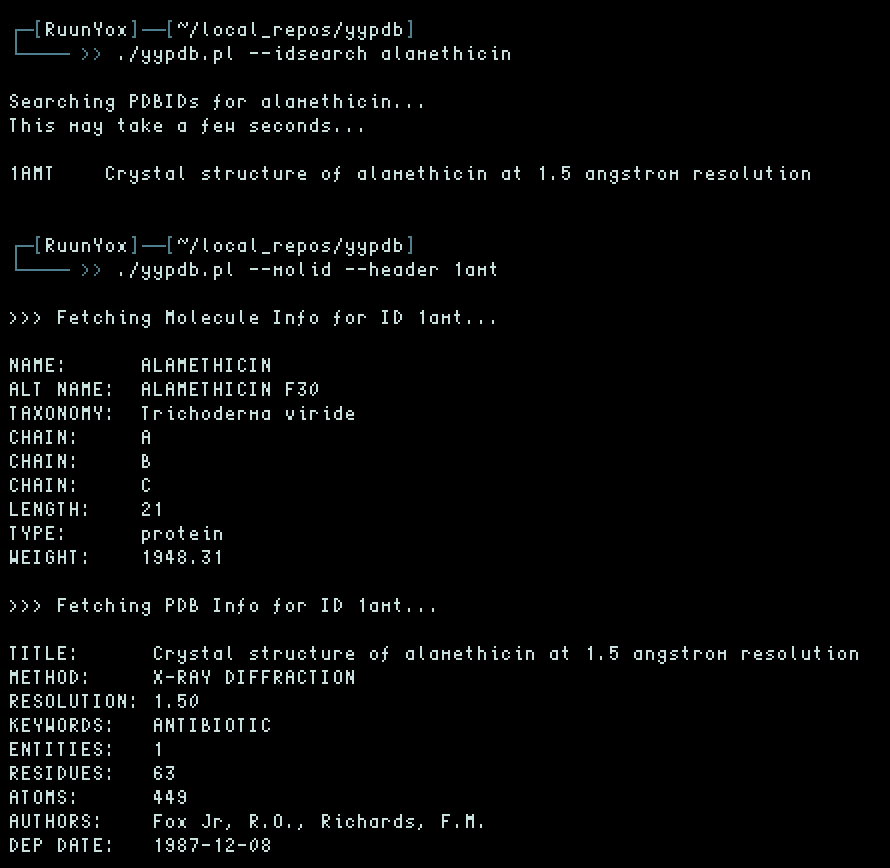

# yypdb
## Command line PDB query and access

---

### Features

Search the PDB for molecular information using site-side REST search
services and XML query. See usage for instructions (--help). 
Search for PDB ids using title keywords. 

Ideally, this script can be used to look up simple information about
proteins and header file information (authors, methods, dates, resolution,
taxonomy, etc.), without leaving the terminal or
navigating the PDB site by mouse (the slow way). 

### Dependencies

* Perl
* wget
* LibXML

### ToDo

* BLAST queries
* Additional REST xml query types
* Grab .ent and .pdb files
* Linux dialog interface

